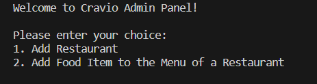

# Cravio
### A Food Delivery App

## Description
This is a food delivery app that allows users to order food from restaurants and at the same time allows restaurants to manage their orders.
This app is built using Java in the backend and JavaFX in GUI.

## How to Run
1. Run the 'Server.java' file in the 'server' package.
2. Run the 'Main.java' file in the 'sample' package.
3. Once the app is running, you can login as a customer or a restaurant.
4. If you login as a customer, you can order food from restaurants and track your orders.
5. If you login as a restaurant, you can manage your orders.

Before running 'Main.java' file, make sure that 'Server.java' file is running.

## Server Side
The server side is built using Java. It uses a TCP connection to communicate with the client side. The server side is responsible for storing the data in the database and sending the data to the client side.

### Activities of Server Side:
1. Add a new restaurant
2. Add a new food item to the menu of a restaurant

  

Addition of a new restaurant and a new food item will not be reflected in the client side until the client side is restarted.  
The server is a console based application.  

## Restaurant Side
The restaurant side will display:
1. The information of the restaurant
2. The menu of the restaurant
3. The pending orders of the restaurant
4. The completed orders of the restaurant
5. The restaurant will be able to see the username of the customer who placed the order and the food items ordered by the customer along with the quantity of each food item.

### Activities of Restaurant Side:
1. The restaurant can login using their unique restaurant ID and password provided by the admin. The credentials of teh restaurant are in 'restaurantAccounts.txt' in 'cravio' package.
2. When a new order is received, the order will be automatically added to the pending orders list.
3. When the restaurant accepts the order, the order will be moved to the completed orders list.
4. The pending order count and the completed order count will be updated automatically.

## Customer Side
The customer side will display:
1. The username of the customer
2. The list of restaurants based on category
3. The number of food items in each restaurant
4. The food search bar
5. The restaurant search bar

### Activities of Customer Side:
1. The customer can login using only their username.
2. In the food search bar, the customer can search for food items based on:
    - Food name
    - Food name in a restaurant
    - Food category
    - Food category in a restaurant
    - Food price
    - Food price in a restaurant
    - Costliest food item in a restaurant.
        
    But the customer cannot order food items from the search bar. The customer can only order food items from the menu of a restaurant.

3. In order to order food items, the customer has to select a restaurant from the list of restaurants.
4. In the restaurant search bar, the customer can search for restaurants based on:
    - Restaurant name
    - Restaurant category
    - Restaurant rating
    - Restaurant price range.
        
    Once the customer selects a restaurant, the customer can order food items from the menu of the restaurant.

5. In the menu of a restaurant, the customer can order food items by selecting the food item and entering the quantity of the food item.
6. The customer can view the list of food items ordered by them in the cart.
7. The customer can remove food items from the cart.
8. The total cost of the food items in the cart will be displayed and updated automatically.
9. Once the customer is done ordering food items, the customer can place the order.
10. Once the order is placed, the customer will be displayed a message saying that the order is placed successfully.
11. The customer can only food items from one restaurant at a time.

# Fun Fact
If you want to run the app using 2 different devices, then you have to change the IP address in the 'Main.java' file in the 'sample' package to your system's IP address for the client system but not the server system. You can find your system's IP address by running the command `ipconfig` in the command prompt.

Then run the server side in one system and the client side in another system. Now you can use the app in both the systems.
Make sure that both the systems are connected to the same network.
